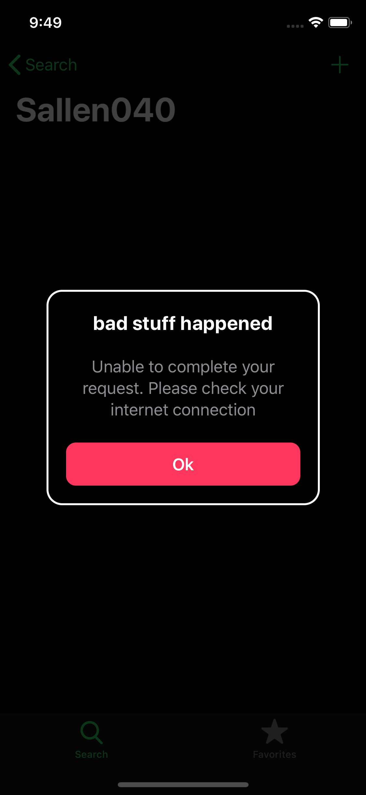
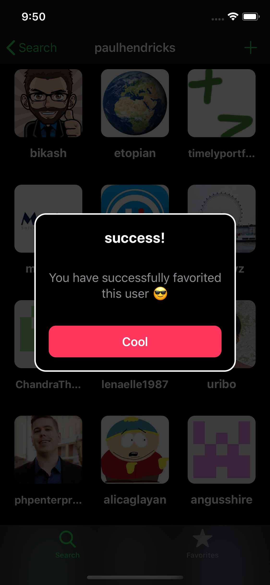
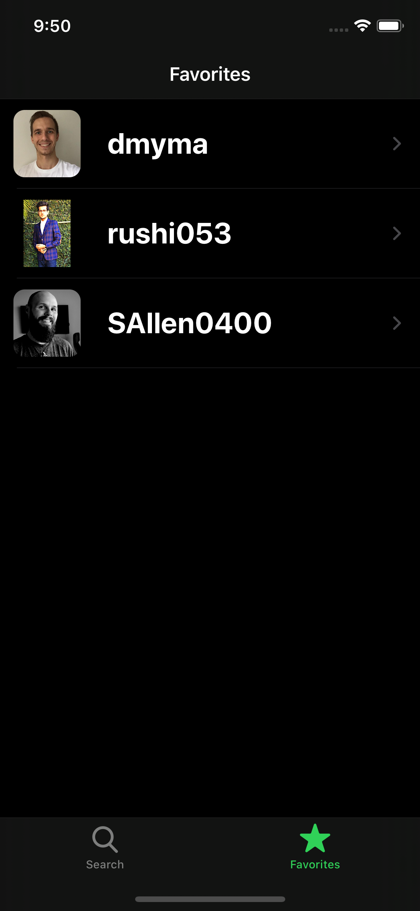
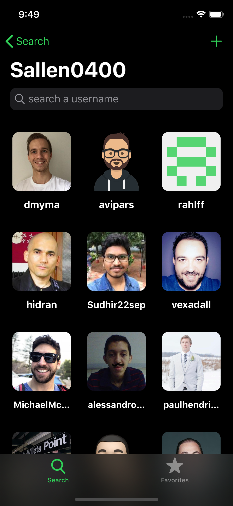

# Github-Followers
Sean Allen course follow along

### Description: 
* This iOS application can search for followers of a particular user and is capable of adding users to favorites
* This app also has an user info screen to display no. of followers, following, gists, repos and their profile

### What I learned:
* Programmatic UI,
* Building custom reusable UI elements,
  * Custom alert,
  * Custom button,
  * Custom Labels etcw
* persistance,
* Code organization,
* MVC,
* writing readable code,
* Caching images,
* Diffable data source,
* Network calls

### Tools and Languges: 
* Xcode,
* Swift 

### Instructor:
> Sean Allen

### Resources:
> https://github.com/aaronbrethorst/SemanticUI

### Screenshots:

  
